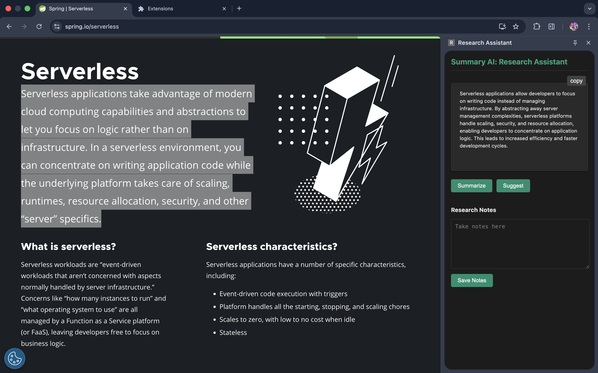

# 🧠 Smart Summary AI – Chrome Extension


Smart Summary AI is a Chrome Extension that automatically summarizes selected text from any webpage using Google Gemini AI. Users can also save important summaries as notes stored securely in Chrome Storage.

---

## 🖼 Screenshot Preview
<div align="center">
  
</div>

---

## 🚀 Features

- ✅ AI-powered text summarization using `Gemini API`
- ✅ Save summaries as notes for future reference
- ✅ Notes persist in Chrome storage
- ✅ Fast and lightweight UI using React (Vite)
- ✅ Works on all websites
- ✅ Spring Boot backend for secure API calls

---

## ⚙️ How It Works

1. Select any text on a webpage  
2. Click the extension icon  
3. click summarize / suggest button according to need
4. Text is sent to backend → Gemini AI generates summary  
5. View summary in extension panel  
6. Save summary as note if needed 

---

## 📝 Notes Panel

- View all saved summaries
- Delete or copy notes anytime
- Notes persist after browser restart

---

## 🔑 Environment Variables

Add Gemini API key into Spring Boot environment:

```
gemini.api.url=${GEMINI_URL}
gemini.api.key=${GEMINI_KEY}
```
---

## ▶️ Installation & Usage

1. Clone this repo  
2. Configure Gemini API key in backend  
3. Run the backend server  
4. Go to `chrome://extensions/`  
5. Enable **Developer Mode**  
6. Click **Load unpacked** and select `frontend` folder  
7. Select text → Click Extension → select `Summarize` or `Suggest`

---

## 🤝 Contributing

PRs and feature requests are welcome!  
Feel free to star ⭐ the project if you like it!

---

## 📄 License

Distributed under the **MIT License**.