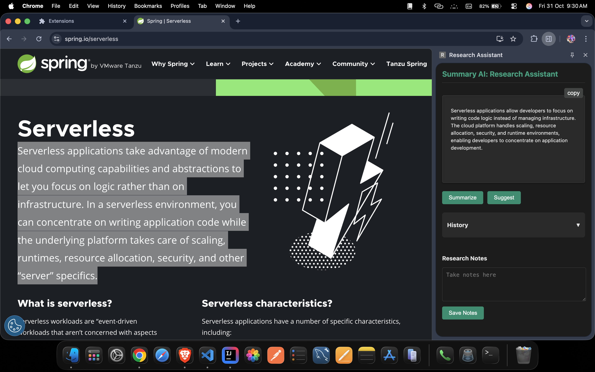
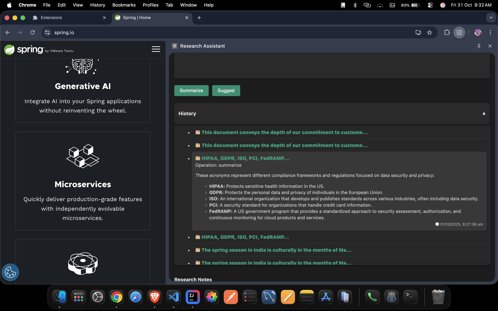

# 🧠 Smart Summary AI – Chrome Extension

[](https://www.oracle.com/in/java/technologies/downloads/)
[](https://spring.io/projects/spring-boot)
[](https://maven.apache.org/)

[](https://html.com/)
[](https://web.dev/learn/css)
[](https://developer.mozilla.org/en-US/docs/Web/JavaScript)
[](https://react.dev/)
[](https://vite.dev/)
[](https://www.jetbrains.com/idea/)
[](https://code.visualstudio.com/)
[](https://developer.chrome.com/docs/extensions)
[](https://ai.google.dev/)

[]()


Smart Summary AI is a Chrome Extension that automatically summarizes selected text from any webpage using Google Gemini AI. Users can also save important summaries as notes stored securely in Chrome Storage.

---

## 🖼 Screenshot Preview
<div align="center">
  
  
</div>

---

## 🚀 Features

- ✅ AI-powered text summarization using **Google Gemini API**
- ✅ Smart **history tracking system** to view all past summaries and suggestions
- ✅ **Markdown rendering** for beautifully formatted AI responses
- ✅ Save and manage **personal research notes** for future reference
- ✅ Notes persist in **Chrome local storage**
- ✅ Fast, responsive, and lightweight **React (Vite)** frontend
- ✅ Secure and scalable **Spring Boot + MySQL** backend
- ✅ Real-time integration between browser extension and backend API
- ✅ Works seamlessly on **any website**


---

## ⚙️ How It Works

1. Select any text on a webpage  
2. Click the **Summary AI** browser extension icon  
3. Choose **Summarize** or **Suggest** based on your need  
4. The selected text is sent to the **Spring Boot backend**, which calls **Google Gemini API** to generate a response  
5. The generated summary is **saved to the MySQL database**  
6. The summarized content is instantly displayed in the **extension panel**  
7. All results are stored and can be **viewed later in the History section**  
8. Optionally, save any response as a **personal note** in Chrome local storage  


---

## 📝 Notes Panel

- View all saved summaries
- Delete or copy notes anytime
- Notes persist after browser restart

---

## 🕒 History Panel

- Automatically stores all past summaries and suggestions  
- View detailed responses with a single click  
- Expand or collapse individual history items for clarity  
- Data is securely saved in the MySQL database  
- Quickly revisit or reuse any previous summary  

---

## 🔑 Environment Variables

Add Gemini API key into Spring Boot environment:

```
gemini.api.url=${GEMINI_URL}
gemini.api.key=${GEMINI_KEY}
```
---

## ▶️ Installation & Usage

1. Clone this repo  
2. Configure Gemini API key in backend  
3. Run the backend server  
4. Go to `chrome://extensions/`  
5. Enable **Developer Mode**  
6. Click **Load unpacked** and select `dist` folder inside `Frontend` folder  
7. Select text → Click Extension → select `Summarize` or `Suggest`

---

## 🤝 Contributing

PRs and feature requests are welcome!  
Feel free to star ⭐ the project if you like it!

---

## 📄 License

Distributed under the **MIT License**.